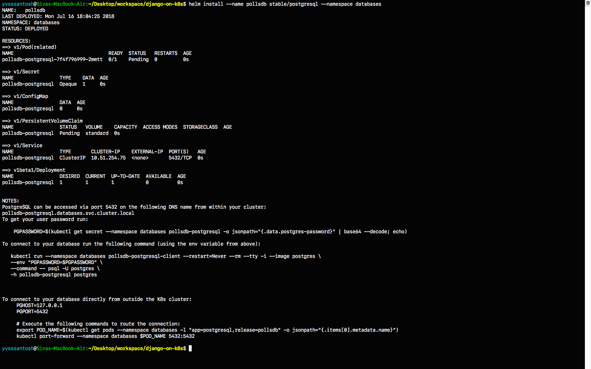
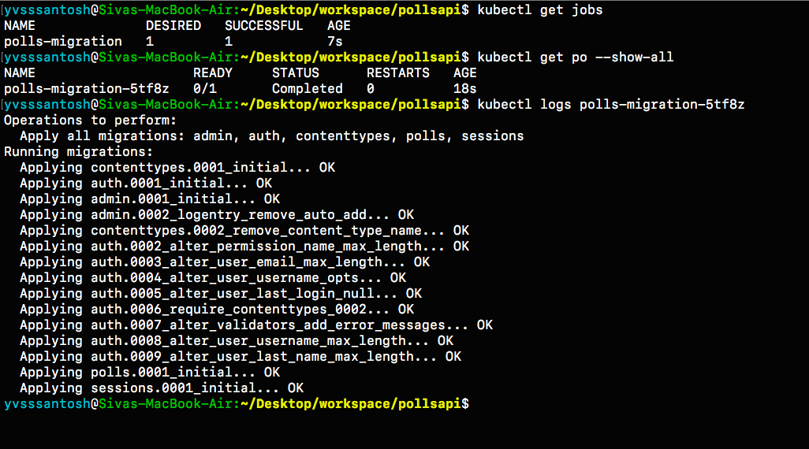
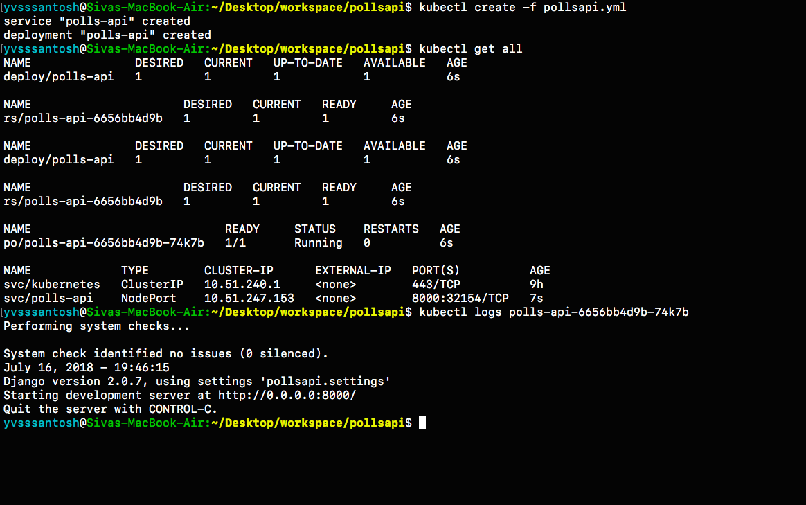
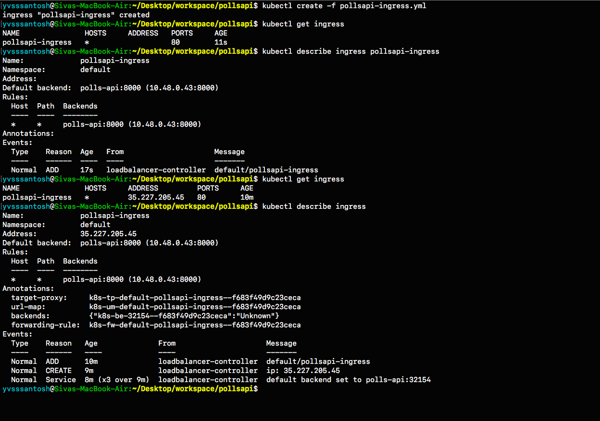
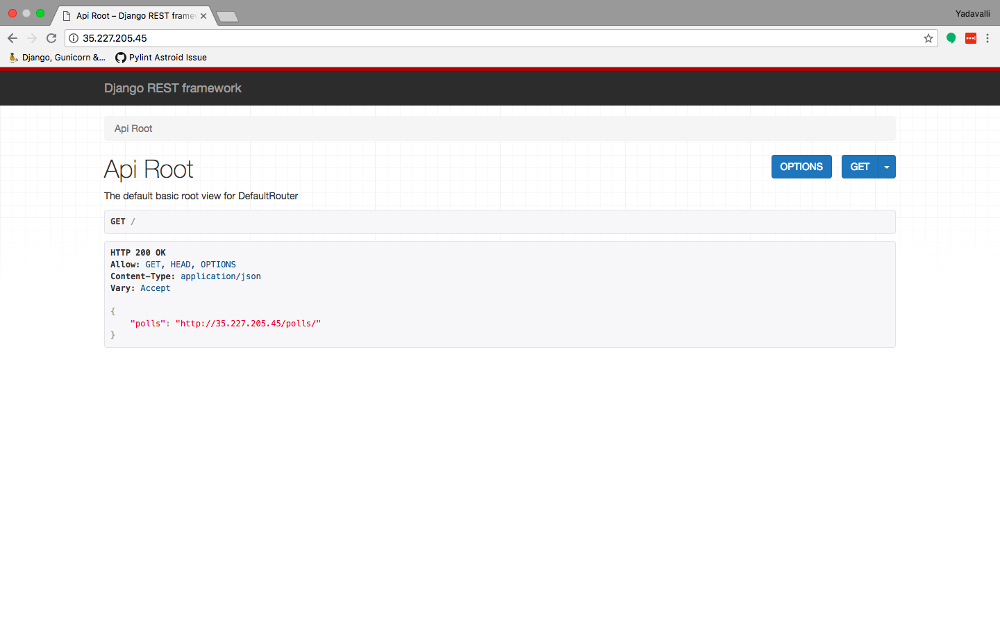

# Django, PostgreSQL on Kubernetes (GKE)

This tutorial should help to deploy a django application on a Kubernetes Cluster. Before starting this tutorial, the user is expected to have basic knowledge of GKE, Django, PostgreSQL and Docker

## Understanding Kubernetes

Before we jump into the tutorial, lets have a basic understanding of what kubernetes is and how will it be useful for us to deploy our django application.

### What is Kubernetes?

**Kubernetes**, at its basic level, is a system for running & co-ordinating containerized applications across a cluster of machines. It is a platform designed to completely manage the life cycle of containerized applications and services using methods that provide predictability, scalability, and high availability.

To know more about kubernetes, visit [here](https://www.digitalocean.com/community/tutorials/an-introduction-to-kubernetes)

Moving on, as a part of this tutorial we'll be deploying Polls API, from [here](https://www.github.com/yvsssantosh/django-polls-rest)

### Local Deployment of Polls API

Let's first clone our sample django application from 

```
git clone https://github.com/yvsssantosh/django-polls-rest.git
```

Just to make sure we're on master branch, run the command `git checkout master`

To test the application locally, let's create a virtual environment, and test the server
```
# Creating a virtual environment
mkvirtualenv pollsapi

# Installing current project requirements
pip install -r requirements.txt

# Connect to postgres
export POSTGRES_USER=pollsdb
export POSTGRES_DB=polls_admin
export POSTGRES_PASSWORD=polls_password
export POLLSAPI_PG_HOST=127.0.0.1

# Running migrations
python manage.py migrate

# Start the local server
python manage.py runserver 0.0.0.0:8000
```

Now that we have tested on local server, lets create a new kubernetes cluster and deploy our application on it.

### Setting up Google Cloud SDK

For instructions to setup Google Cloud SDK navigate to https://cloud.google.com/sdk

Read the installation instructions and setup accordingly. Once done, check the installation status by running the command
```
$ gcloud -v
```
It should show an output similar to this:


### Setting up kubectl command line

To manage and maintain a kubernetes cluster from our desktop/laptop we need to setup kubectl command line. It can be done using the command

```
gcloud components install kubectl
```

Once the installation finishes, we should see something like this:


### Creating a kubernetes cluster

Navigate to `https://console.cloud.google.com`. Select an existing project or create a new one, based on requirement.

Then click on Kubernetes Engine from the navigate menu which would result in the following page


Create a new cluster. I've created a cluster based on the following settings
```
Cluster name        :   pollsapi
Location            :   Zonal
Zone                :   asia-south1-a
Cluster Version     :   1.9.7-gke.3 (default)
Machine Type        :   Small (1 shared CPU with 1.7GB Memory)
Node Image          :   Core OS (cos)
Size                :   2
Boot Disk Size      :   20GB per Node

#######################################################################################
## Only for testing purposes as preemptible nodes are NOT recommended for Production ##
#######################################################################################

Preemptible Nodes   :   Yes
```

`Please be patient as it takes some time to create the cluster`

Once the cluster is created, we'll be able to see a tick mark beside the name of the cluster.


Now click on `Connect` and copy the command shown, and paste it in terminal.


Once connected run the command `kubectl get all`.


Now that the cluster is up and running, lets package our application into a containerized one using docker.

### Setting up Google Container Registry using Docker

Configuring docker with gcloud:
```sh
gcloud auth config-docker
```


Once docker is configured, we are ready to build the image.

```sh
# Build the image
# Common format to push an image to google container registry is gcr.io/$PROJECT_ID/$IMAGE_NAME:$TAG

export PROJECT_ID=YOUR_PROJECT_ID_HERE
export IMAGE_NAME=YOUR_IMAGE_NAME_HERE
export TAG=YOUR_IMAGE_TAG (optional, default is `latest`)

# In my case, giving the tag as v1.0.0 (default is latest)
docker build -t gcr.io/test-gcp-208915/pollsapi:v1.0.0 . 
# (Note the . in the end)

# Push the image
docker push gcr.io/test-gcp-208915/pollsapi:v1.0.0
```

Once the image has been pushed, paste the push URL in browser. It will ask you to sign in into google account which has been used to configure this cluster (if not already signed in).


Since our image has been uploaded sucessfully, we need to setup the database next.

### Setting up Helm Package Manager

The simplest way of setting up PostgreSQL on kubernetes is with the help of [Helm Package Manager](https://github.com/kubernetes/helm)

For mac users, the command to install helm (using brew) is:
```sh
# Install Helm
brew install kubernetes-helm

# Setup Helm
helm init
```

* `Note`: Often during package installation i.e., `helm install --name MY_RELEASE stable/PACKAGE_NAME` a common error is generated explaining tiller not having access to create cluster role bindings. This usually happens if the user logged inside Google Cloud SDK doesn't have proper access to create role bindings or issues with helm installation.

If that error occurs, then run the following commands:

```sh
# Completely uninstall helm
helm reset --force

# Remove directories created by helm
sudo rm -r ~/.helm
```

Once helm is completely removed, create a clusterrolebinding and a serviceaccount for helm using the code below

`rbac-config.yaml`

```yaml
apiVersion: v1
kind: ServiceAccount
metadata:
  name: tiller
  namespace: kube-system
---
apiVersion: rbac.authorization.k8s.io/v1beta1
kind: ClusterRoleBinding
metadata:
  name: tiller
roleRef:
  apiGroup: rbac.authorization.k8s.io
  kind: ClusterRole
  name: cluster-admin
subjects:
  - kind: ServiceAccount
    name: tiller
    namespace: kube-system
```

Create a file named rbac-config.yaml and run the following using kubectl command line
```sh
# Creating Service Account and ClusterRoleBinding Tiller
kubectl create -f rbac-config.yaml
```

Once this is sucessfully done, initialize helm using
```sh
helm init --service-account tiller
```

And then run the command to install Postgresql in our cluster, as previously mentioned.

### Setting up PostgreSQL

Before we setup PostgreSQL, lets create a namespace `databases`
```sh
# Why create namespace databases?
# This command is totally optional, but this is prefered this because I place all the 
# databases created in a single namespace so that they'll be easy to access.
kubectl create namespace databases

# Before creating PostgreSQL using helm, lets understand few basics.

# Default command of creation enables Persistent Volume Claim (PVC)
# Instead of default postgres username, we are setting custom user.
# So replace YOUR_POSTGRES_USER with desired username, in my case polls_admin &
# MY_RELEASE_NAME, which in my case is pollsdb &
# MY_DATABASE_NAME, which in my case is pollsdb

# helm install --name MY_RELEASE_NAME stable/postgresql --set postgresUser=YOUR_POSTGRES_USER,postgresDatabase=MY_DATABASE_NAME --namespace databases

helm install --name pollsdb stable/postgresql --set postgresUser=polls_admin,postgresDatabase=pollsdb --namespace databases

# If user wishes not to have a separate namespace then just ignore the last two words
# i.e. --namespace databases
```
For more options on customizing postgres with custom parameters, see [here](https://github.com/kubernetes/charts/tree/master/stable/postgresql)


**DO NOT FORGET to take a note of PGPASSWORD as seen in the NOTES section (above image) once postgres has been created**

```sh
# Saving password of PostgreSQL into environemt varialble $PGPASSWORD
PGPASSWORD=$(kubectl get secret --namespace databases pollsdb-postgresql -o jsonpath="{.data.postgres-password}" | base64 --decode; echo)

# Why save the password?
# Since we have created a separate namespace for databases, secrets from one namespaces cannot be accessed from another
# So in order to access the postgres password in the default namespace, we must create a new secret
# Let's first convert our password into base64 encoding.

echo -n $PGPASSWORD | base64

# MUST DO : Copy the generated value and replace it with `YOUR_ENCODED_PASSWORD` in the `polls-password-secret.yml`. Then create the secret.

kubectl create -f pollsdb-password-secret.yml

# Now that the secret has been setup, lets migrate the data.
kubectl create -f polls-migration.yml

# Wait for a minute and check the status of the migration using folling commands.
kubectl get jobs

# In order to check the logs, identify the pod running the pod running migration.
kubectl get pods --show-all

# Check the logs of the pod
# kubectl logs POD_NAME
kubectl logs polls-migration-5tf8z

# Since the jobs have passed, there is no need for them to exist.
# We can just delete the jobs using
kubectl delete -f polls-migration.yml

```




### Setting up Django Application

Now that we have the database ready with migrations, lets start our application.
```sh
# Start application
kubectl create -f pollsapi.yml
```


Note that the external IP is not pointing to anything. Which means we still cannot access the application outside in our web-browser. Lets create an Ingress to expose our application.

### Exposing our Application

Lets create an Ingress to expose our application.

```sh
kubectl create -f pollsapi-ingress.yml
```

Note that creating an ingress may take atleast `10 minutes`, or sometimes even more.
Please be patient while an ingress is being created

To check the status of the ingress, see below


As observed, it took almost `10 minutes` for the ingress to setup properly.
On navigating to the ingress address generated for me i.e. http://35.227.205.45/



### Documentation for Polls API


```
For any queries, please create an issue.
```
