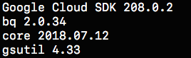
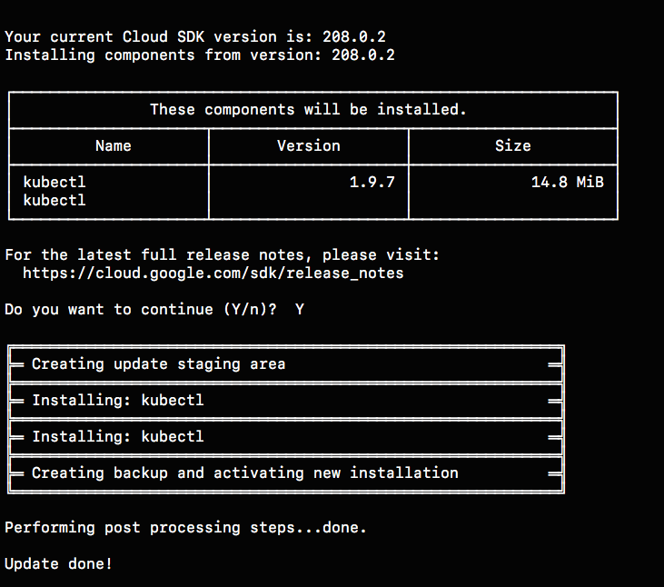
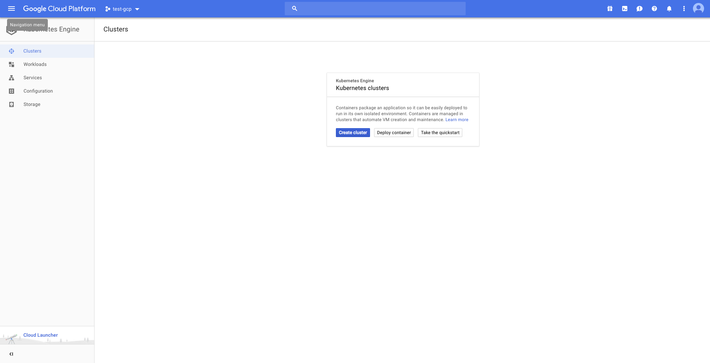
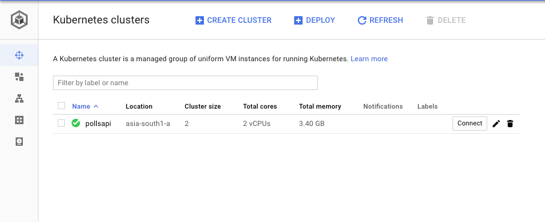
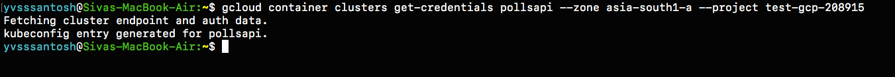
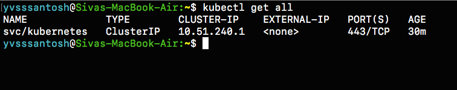
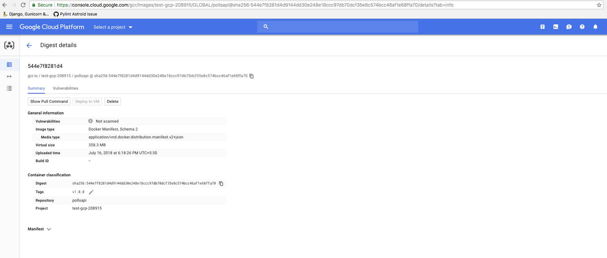

# Django, PostgreSQL on Kubernetes (GKE)

This tutorial should help to deploy a django application on a Kubernetes Cluster. Before starting this tutorial, the user is expected to have basic knowledge of GKE, Django, Docker and docker-compose.

## Understanding Kubernetes

Before we jump into the tutorial, lets have a basic understanding of what kubernetes is and how will it be useful for us to deploy our django application.

### What is Kubernetes?

**Kubernetes**, at its basic level, is a system for running & co-ordinating containerized applications across a cluster of machines. It is a platform designed to completely manage the life cycle of containerized applications and services using methods that provide predictability, scalability, and high availability.

To know more about kubernetes, visit [here](./understanding-kubernetes.md)

Moving on, as a part of this tutorial we'll be deploying Polls API, from [here](https://www.github.com/yvsssantosh/django-polls-rest)

### Local Deployment of Polls API

Let's first clone our sample django application from 

```
git clone https://github.com/yvsssantosh/django-polls-rest.git
```

Just to make sure we're on master branch, run the command `git checkout master`

To test the application locally, let's create a virtual environment, and test the server
```
# Creating a virtual environment
mkvirtualenv pollsapi

# Installing current project requirements
pip install -r requirements.txt

# Running migrations
python manage.py migrate

# Start the local server
python manage.py runserver 0.0.0.0:8000
```

Now that we have tested on local server, lets create a new kubernetes cluster and deploy our application on it.

### Setting up Google Cloud SDK

For instructions to setup Google Cloud SDK navigate to https://cloud.google.com/sdk and choose the OS for which you want to set it up.

Read the installation instructions and setup accordingly. Once done, check the installation status by running the command
```
$ gcloud -v
```
It should show an output similar to this:



### Setting up kubectl command lime

To manage and maintain a kubernetes cluster from our desktop/laptop we need to setup kubectl command line. It can be done simply by using the command

```
gcloud components install kubectl
```

Once the installation finishes, we should see something like this:


### Creating a kubernetes cluster

Navigate to `https://console.cloud.google.com`. Select an existing project or create a new one, based on requirement.

Then click on Kubernetes Engine from the navigate menu which would result in the following page



Create a new cluster based on your requirement. I've created a cluster based on the following settings
```
Cluster name        :   pollsapi
Location            :   Zonal
Zone                :   asia-south1-a
Cluster Version     :   1.9.7-gke.3 (default)
Machine Type        :   Small (1 shared CPU with 1.7GB Memory)
Node Image          :   Core OS (cos)
Size                :   2
Boot Disk Size      :   20GB per Node

#######################################################################################
## Only for testing purposes as preemptible nodes are NOT recommended for Production ##
#######################################################################################

Preemptible Nodes   :   Yes
```

`Please be patient as it takes some time to create the cluster`

Once the cluster is created, we'll be able to see a tick mark beside the name of the cluster.



Now click on `Connect` and copy the command shown, and paste it in terminal.



Once connected run the command `kubectl get all`.



This shows that our cluster is up and running.

Now the the cluster is created and connected sucessfully, lets package our application into a containerized one using docker.

### Setting up PostgreSQL

Before we setup PostgreSQL, for simpler understanding lets create a namespace `databases`
```
kubectl create namespace databases
```
This command is totally optional, but I prefer this because, I place all the databases I create come under a single namespace so that they'll be easy to access.

The simplest way of setting up PostgreSQL on kubernetes is with the help of `Helm Package Manager`. To install helm on kubernetes see [here](https://github.com/kubernetes/helm)

For mac users, the command to install helm (using brew) is:
```sh
# Install Helm
brew install kubernetes-helm

# Setup Helm
helm init
```

Once helm is setup sucessfully, run the command

```sh
# Default command, with Persistent volume claim, and in namespace databases
helm install --name pollsdb stable/postgresql --namespace databases

# If user wishes not to have a separate namespace then just ignore the last two words
# i.e. --namespace databases
```
* `Note`: Often, for first time users, this might generate an error saying that tiller doesn't have access permissions to create clusterrolebinding. This usually happens if the user logged inside Google Cloud SDK doesn't have access to create Cluster Role Bindings (which is usually available only for administrators)

If that error occurs, then run the following commands:

```sh
# Completely uninstall helm
helm reset --force

# Remove directories created by helm
sudo rm -r ~/.helm
```

Once helm is completely removed, create a clusterrolebinding and a serviceaccount for helm using the code below

`rbac-config.yaml`

```yaml
apiVersion: v1
kind: ServiceAccount
metadata:
  name: tiller
  namespace: kube-system
---
apiVersion: rbac.authorization.k8s.io/v1beta1
kind: ClusterRoleBinding
metadata:
  name: tiller
roleRef:
  apiGroup: rbac.authorization.k8s.io
  kind: ClusterRole
  name: cluster-admin
subjects:
  - kind: ServiceAccount
    name: tiller
    namespace: kube-system
```

Create a file named rbac-config.yaml and run the following using kubectl command line
```sh
# Creating Service Account and ClusterRoleBinding Tiller
kubectl create -f rbac-config.yaml
```

Once this is sucessfully done, initialize helm using
```sh
helm init --service-account tiller
```

And run the [command](https://generate-permalink-and-paste-here) to install Postgresql in our cluster

* `Note`: Once the database is setup, make sure to take the password

### Setting up Django Application

Configuring docker with gcloud:
```sh
gcloud auth config-docker
```


Once docker is configured, we are ready to build the image.

```sh
# Build the image
# Common format to push an image to google container registry is gcr.io/$PROJECT_ID/$IMAGE_NAME

export PROJECT_ID=YOUR_PROJECT_ID_HERE
export IMAGE_NAME=YOUR_IMAGE_NAME_HERE

# In my case, giving the tag as v1.0.0 (default is latest)
docker build -t gcr.io/test-gcp-208915/pollsapi:v1.0.0 . 
# (Note the . in the end)

# Push the image
docker push gcr.io/test-gcp-208915/pollsapi:v1.0.0
```

Once the image has been pushed, paste the push URL in browser. It will ask you to sign in into google account (if not already signed in).



Now that we have the container image ready, and the database up and running, lets write kubernetes scripts to:
1. Perform migrations
2. Run the application server
3. Expose the application to real world using ingress

#### Perform Migrations

